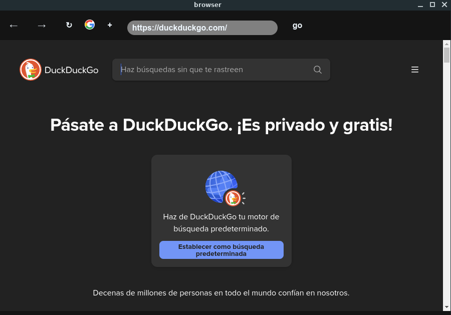

# Browser ElectronJS

Este proyecto es un Browser construido con **ElectronJS**. Permite a los usuarios buscar, ver y controlar eh ingresar a sus sitios web favoritos directamente desde la interfaz de la aplicación.tiene como buscador predeterminado Duckduckgo  para proporcionar una experiencia fluida y moderna sin rastreadores de anuncios.


## Url para descargar el software
[wolfbyte-browser.vercel.app](https://wolfbyte-browser.vercel.app)
## Preview del proyecto


## Características

- Búsqueda de contenido sin restricciones.

- Diseño intuitivo y responsivo.

- Soporte para la reproducción en pantalla completa.

## App

Si deseas descargar la aplicacion **Completa** puesde hacerlo ingresando aqui , y seleccionas tu sistema operativo favorito [https://youvideo.vercel.app/].

## Requisitos

Asegúrate de tener instalados los siguientes programas en tu sistema:

- **Node.js** (LTS recomendado)
- **npm** (Node Package Manager)
- **Electron** (Instalado automáticamente con el proyecto)

## Instalación

Sigue estos pasos para clonar el repositorio y configurar el proyecto localmente:

1. Clona el repositorio a tu máquina local:

   ```bash
   git clone https://github.com/Guts-behelit/browser-google.git
2. Navega al directorio del proyecto:
   
   ```bash
   cd browser-google
3. Instala las dependencias del proyecto usando npm:

   ```bash
   npm install
4. Inicia la aplicación en modo de desarrollo:

   ```bash
   npm start  

# Uso

Una vez que la aplicación esté en funcionamiento, podrás buscar las webs que desees utilizando el cuadro de búsqueda en la parte superior de la pantalla o del mismo buscador de la pagina de inicio. Los resultados aparecerán como un browser normal, cada uno con su respectiva miniatura eh informacion.

cabe destacar que solo tiene funcionalidades de busqueda mas no de agregar plugins como un chrome nativo , la app solo simula a un browser.

# Atención
El proyecto esta configurado para hacer el build para **linux** , si tienes otro sistema operativo como **windows**, o otra distribucion distinta a la de **.deb**, se recomieda encaresidamente que se modifique el apartado del **package.json** en la seccion de build.
 ## Linux por default (.deb)
   ```json
   "build": {
    "appId": "com.picachuBrowser.app",
    "productName": "Picachu Browser",
    "linux": {
      "target": [
        "deb"
      ],
      "category": "Utility",
      "icon": "resources/picachu.png"
    },
    "win": {
      "target": "nsis"
    },
    "mac": {
      "target": "dmg"
    }
  }
  ```
### build :
 ```bash
npm run build:linux

 ```
## Windows
Para hacer el ejecutable compatible con windows remplaza con este codigo :
   ```json
   "build": {
  "appId": "com.picachuBrowser.app",
  "productName": "Picachu Browser",
  "linux": {
    "target": [
      "deb"
    ],
    "category": "Utility",
    "icon": "resources/picachu.png"
  },
  "win": {
    "target": [
      "nsis"
    ],
    "icon": "resources/picachu.ico"
  },
  "mac": {
    "target": "dmg",
    "icon": "resources/picachu.icns"
  }
}
  ```
  ### build :
 ```bash
 npm run build:win

 ```
## rpm
Para hacer el ejecutable compatible con distribuciones con rpm  remplaza con este codigo :
  ```json
  "build": {
  "appId": "com.picachuBrowser.app",
  "productName": "Picachu Browser",
  "linux": {
    "target": [
      "deb",
      "rpm"
    ],
    "category": "Utility",
    "icon": "resources/picachu.png"
  },
  "win": {
    "target": [
      "nsis"
    ],
    "icon": "resources/picachu.ico"
  },
  "mac": {
    "target": "dmg",
    "icon": "resources/picachu.icns"
  }
}
```
### build :
 ```bash
 npm run build --linux

 ```
# Contribuciones

Las contribuciones son bienvenidas. Si deseas mejorar el proyecto, sigue estos pasos:

1. Haz un fork del repositorio.
2. Crea una rama para tus cambios (git checkout -b mi-nueva-funcionalidad).
3. Haz tus cambios y haz commit de ellos (git commit -am 'Agrega nueva funcionalidad').
4. Haz push de tu rama (git push origin mi-nueva-funcionalidad).
5. Abre un pull request describiendo los cambios.

# Licencia
Este proyecto está bajo la licencia MIT.
